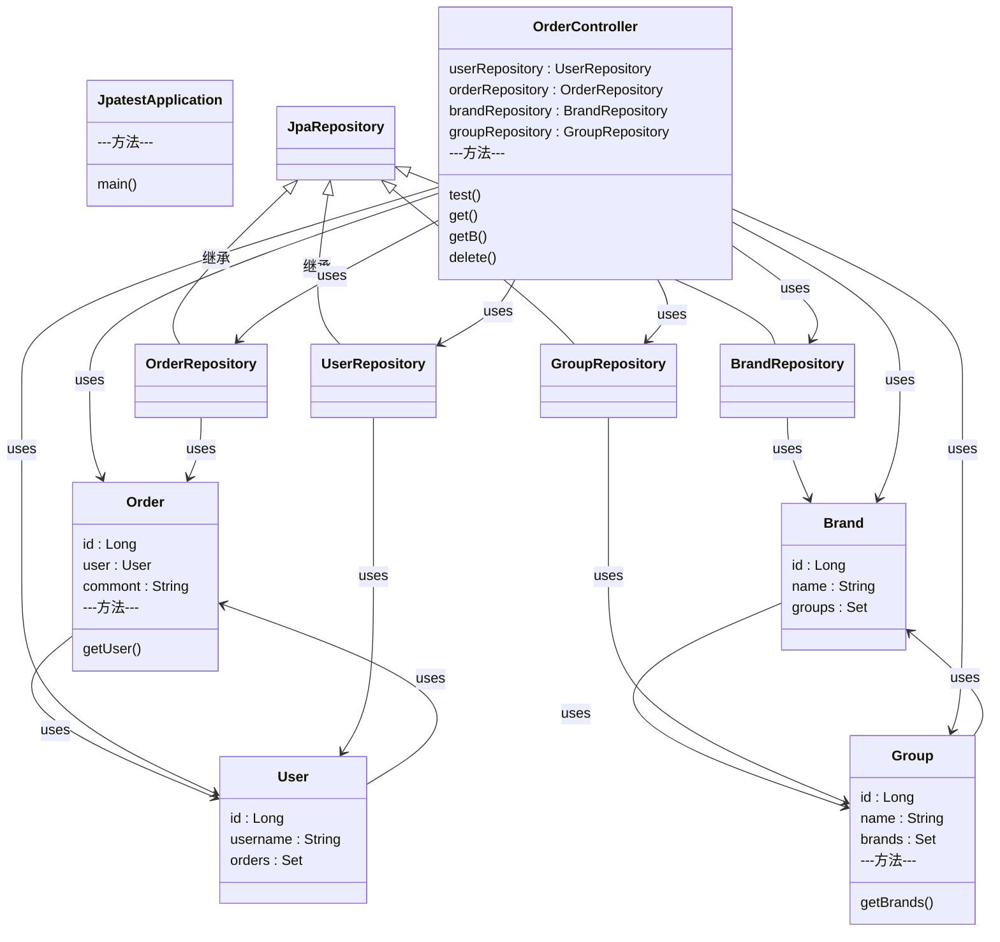

```mermaid
classDiagram
    class Brand {
        id : Long
        name : String
        groups : Set<Group>
    }
    class BrandRepository {
    }
    class Group {
        id : Long
        name : String
        brands : Set<Brand>
        ---方法---
        getBrands()
    }
    class GroupRepository {
    }
    class JpatestApplication {
        ---方法---
        main()
    }
    class Order {
        id : Long
        user : User
        commont : String
        ---方法---
        getUser()
    }
    class OrderController {
        userRepository : UserRepository
        orderRepository : OrderRepository
        brandRepository : BrandRepository
        groupRepository : GroupRepository
        ---方法---
        test()
        get()
        getB()
        delete()
    }
    class OrderRepository {
    }
    class User {
        id : Long
        username : String
        orders : Set<Order>
    }
    class UserRepository {
    }
    JpaRepository <|-- BrandRepository : 继承
    JpaRepository <|-- GroupRepository : 继承
    JpaRepository <|-- OrderRepository : 继承
    JpaRepository <|-- UserRepository : 继承

    %% 依赖关系
    Brand --> Group : uses
    BrandRepository --> Brand : uses
    Group --> Brand : uses
    GroupRepository --> Group : uses
    Order --> User : uses
    OrderController --> Order : uses
    OrderController --> Brand : uses
    OrderController --> Group : uses
    OrderController --> UserRepository : uses
    OrderController --> User : uses
    OrderController --> OrderRepository : uses
    OrderController --> GroupRepository : uses
    OrderController --> BrandRepository : uses
    OrderRepository --> Order : uses
    User --> Order : uses
    UserRepository --> User : uses
```
